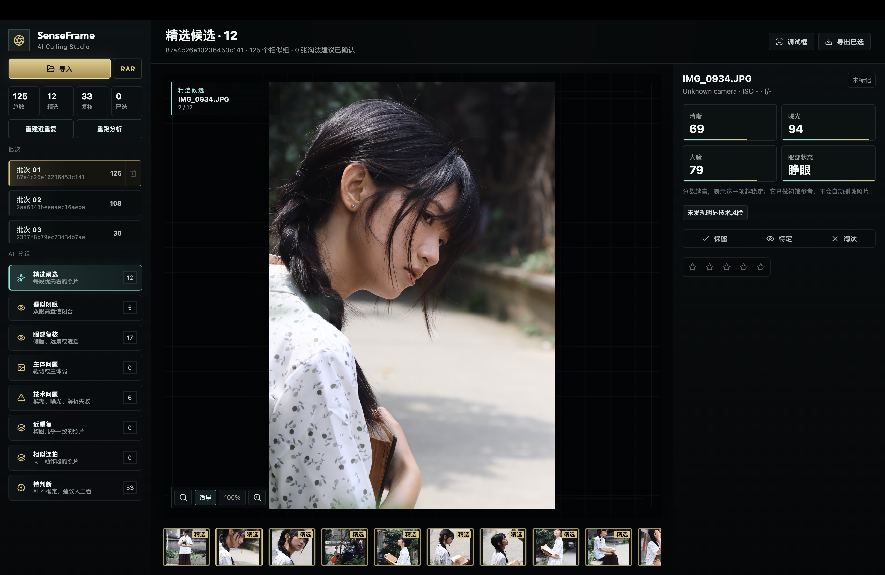

# SenseFrame

[English](README.md) | 简体中文



SenseFrame 是一个面向摄影师的本地优先 AI 选片工作台，适合需要处理大量素材、但仍希望掌握最终审美判断的人。

它会把几百张、上千张照片先整理成一个可以直接工作的审片台：优先看候选，风险片单独复核，近重复和连拍自动成组，小宫还能根据你的任务重新组织照片列表。

## 为什么是 SenseFrame

- **为真实选片流程设计**：导入、比较、保留、待定、淘汰、评分、导出都在一个桌面工作台完成。
- **本地优先**：原片保留在你的电脑上，审片状态和预览缓存单独管理。
- **先把混乱素材整理好**：技术问题、疑似闭眼、主体问题、近重复、相似连拍、待判断会提前分出来。
- **懂连拍和相似图**：把相似照片放在一起比较，减少在大量重复画面里来回翻找。
- **小宫是审片副驾**：你可以让小宫找最好看的、复核误判、解释推荐原因，或者生成一个专门的小宫视图。
- **越用越懂你的审美**：小宫会围绕采纳、不采纳、评分、导出和你的口头策略，逐步学习你的选片偏好。
- **摄影师仍然掌控最终选择**：AI 负责整理和解释，保留、待定、淘汰、评分和导出由你决定。

## 主要能力

- 导入本地文件夹或 RAR 压缩包。
- 自动生成缩略图和预览图。
- 按精选候选、疑似闭眼、眼部复核、主体问题、技术问题、近重复、相似连拍、待判断等视图整理照片。
- 对近重复和相似连拍进行分组，帮助快速比较同一动作或同一构图里的候选。
- 支持保留、待定、淘汰和星级评分。
- 支持语义搜索和当前照片解释。
- 支持“小宫审片”，由小宫读取整批照片并生成更统一的审片判断。
- 支持“小宫视图”，例如让小宫找出它认为最好看的照片，并把结果作为可浏览的照片列表呈现。
- 小宫会根据你的反馈和反复选择逐步贴近你的审片风格。
- 支持导出已选照片和 CSV 清单。

## 小宫是什么

小宫是 SenseFrame 里的摄影审片副驾。

它不是普通聊天机器人，也不是简单的打分器。小宫会结合当前批次、照片分组、人工选择、风险提示和已有审片结果，帮你完成更高层的整理工作。

你可以对小宫说：

```text
给我找出你认为最好看的图片
复核闭眼误判
每组连拍选 1 张
解释这张为什么被推荐
```

小宫的结果会体现在工作台里：左侧出现小宫视图，中间显示推荐照片，底部胶片条按小宫排序，右侧显示当前照片的理由。

随着使用次数增加，小宫会记住你采纳了什么、拒绝了什么、给了几星、最终导出了哪些照片，以及你明确说过的审片策略，让后续推荐更接近你的个人审美。

## 当前状态

SenseFrame 仍在快速开发中。当前版本适合本地试用和产品验证，正式安装包、代码签名、自动更新和更完整的小宫记忆能力会逐步接入。

## 本地运行

```bash
pnpm install
pnpm dev
```

构建检查：

```bash
pnpm build
```
