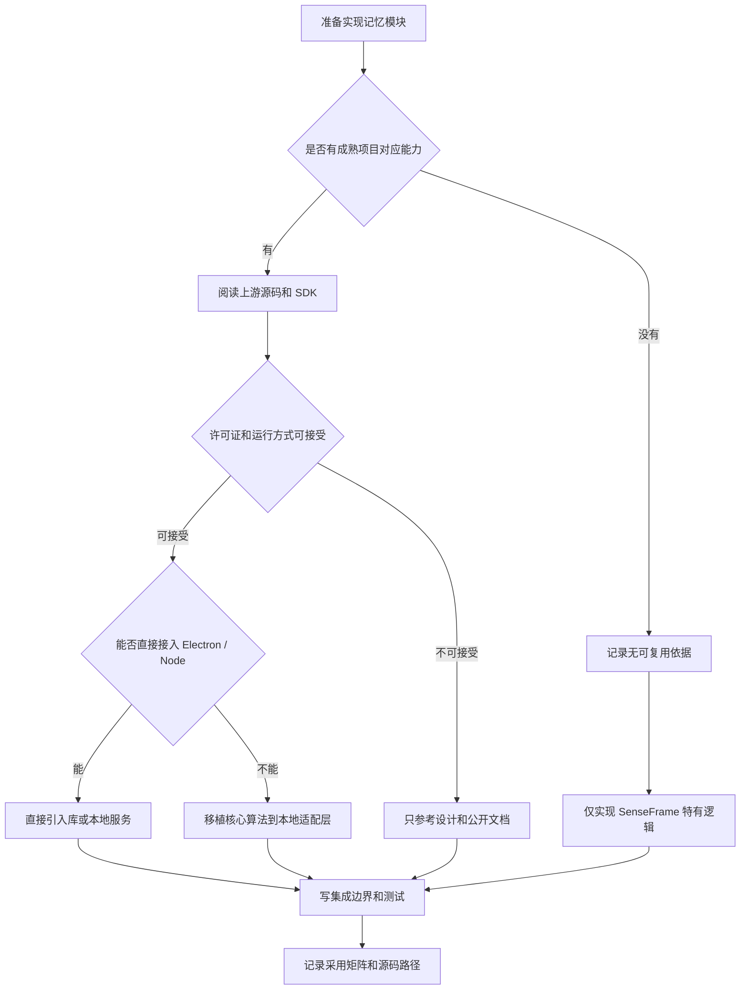
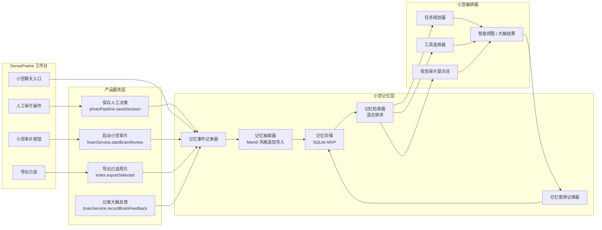
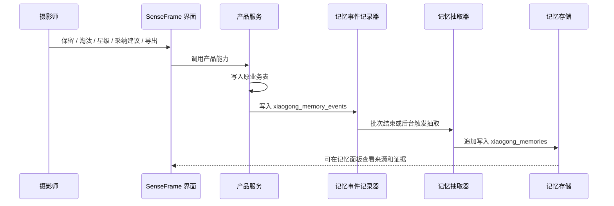
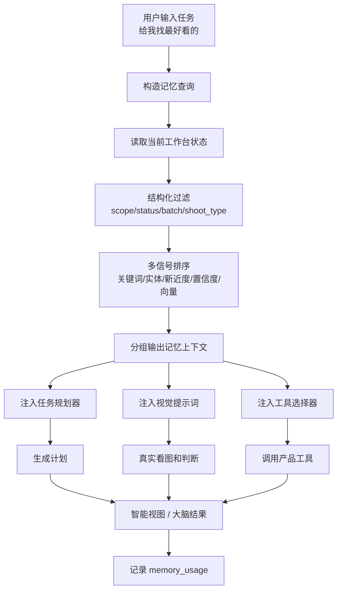
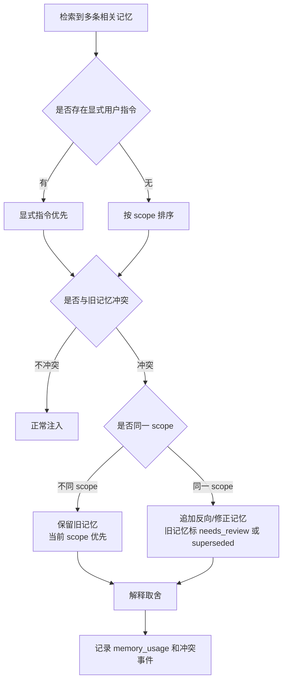
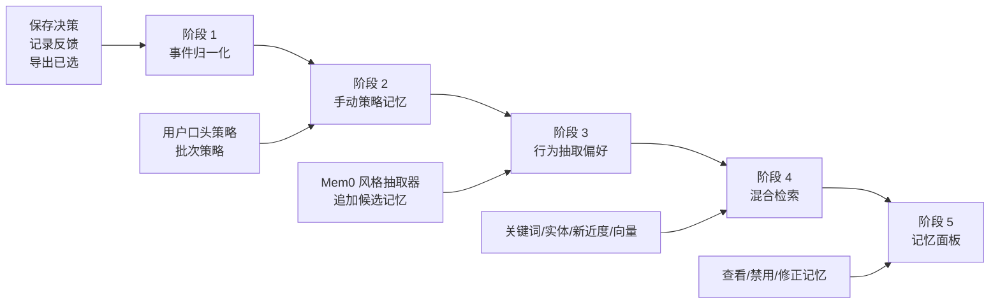

# SenseFrame 小宫记忆系统技术方案

> [!summary]
> 小宫记忆系统第一版不自己发明复杂架构，而是明确借鉴成熟 AI memory 系统：以 Mem0 的 ADD-only extraction 和 hybrid retrieval 为主线，借鉴 Redis Agent Memory 的 working memory / long-term memory 分层，借鉴 Neo4j Agent Memory 的 reasoning memory，借鉴 Zep / Graphiti 的 temporal validity 思想。SenseFrame MVP 先用本地 SQLite 实现，后续可平滑升级到向量索引或图记忆。

## 代码复用原则

这套记忆系统后续实现时不能只“借鉴概念”，必须先读成熟项目源码和 SDK，按可复用程度分级。

优先级：

1. **直接依赖成熟库**
   如果 Mem0、Redis Agent Memory、Graphiti、Neo4j Agent Memory 有适合 Electron / Node / 本地运行的 SDK 或服务，并且许可证、体积、运行方式可接受，优先直接接入。

2. **移植成熟实现里的核心模块**
   如果成熟项目依赖云服务、Redis、Neo4j 或常驻 server，不适合 SenseFrame MVP，就参考其源码中的 extractor、dedupe、retrieval、ranking、memory schema、prompt 模板和测试用例，移植为本地 SQLite 版本。

3. **只在产品适配层自研**
   只有 SenseFrame 特有的部分才自研，例如照片评分字段映射、摄影偏好结构、批次/连拍/闭眼误判的 domain adapter。

4. **每个模块落地前都要做复用评审**
   不能直接开写。必须先输出：
   - 上游项目和具体源码路径。
   - 许可证判断。
   - 能直接用、改造用、暂不采用的结论。
   - 为什么不直接接库。
   - 我们改造后保留了哪些上游行为。

### 外部项目采用矩阵

| 项目 | 优先复用内容 | 直接接入判断 | SenseFrame 适配方式 |
| --- | --- | --- | --- |
| Mem0 | extraction、ADD-only memory、dedupe、hybrid retrieval、evaluation 思路 | 优先检查 SDK 能否本地接入 | 若不能直接接，移植 extractor/retrieval 行为到 SQLite |
| Redis Agent Memory Server | working / long-term memory 分层、extraction strategies、metadata filtering | 中期可作为 server 形态参考 | MVP 不强依赖 Redis，先复刻分层和策略接口 |
| Neo4j Agent Memory | reasoning memory、工具链轨迹、memory graph 组织 | 不作为 MVP 依赖 | 先用 SQLite 表记录 reasoning memory，保留未来图迁移字段 |
| Zep / Graphiti | temporal validity、episode、事实有效期、冲突处理 | 不作为 MVP 依赖 | 先实现 valid_from / valid_to / supersedes / status |

### 实现前源码复用检查流程



## 参考系统与借鉴结论

### 1. Mem0：主借鉴对象

GitHub: https://github.com/mem0ai/mem0

Mem0 的新算法最值得我们借鉴三点：

- **ADD-only extraction**：新记忆只追加，不直接 UPDATE / DELETE 旧记忆。
- **agent-generated facts first-class**：agent 执行并确认过的动作，也是一等记忆。
- **multi-signal retrieval**：语义、关键词、实体匹配并行打分，再融合排序。

这对小宫非常关键。

摄影偏好经常不是稳定规则，而是在不同拍摄类型、不同批次、不同审片阶段里变化。如果我们过早把记忆合并成一句“用户喜欢干净构图”，就会误伤后面的纪实活动批次。ADD-only 的好处是保留历史证据，让新旧偏好并存，再由检索和时间权重决定这次该用哪条。

小宫第一版应该借鉴 Mem0 的核心思想：

```text
用户行为 / 小宫动作 / 人工反馈
  -> 单次抽取新事实
  -> 只追加 memory
  -> 用 hash 去重
  -> 检索时融合 semantic + keyword + entity + recency
```

### 2. Redis Agent Memory：分层记忆模型

GitHub: https://github.com/redis/agent-memory-server

Docs: https://redis.github.io/agent-memory-server/

Redis Agent Memory 的核心借鉴是两层：

- **工作记忆（Working Memory）**：会话级、当前任务级上下文，可摘要。
- **长期记忆（Long-Term Memory）**：跨会话、可检索、持久化偏好和事实。

这对应 SenseFrame：

```text
工作记忆
  当前批次、小宫当前任务、聊天上下文、临时策略、当前 SmartView

长期记忆
  摄影师长期偏好、反复采纳/拒绝规律、导出偏好、不同拍摄类型策略
```

Redis 还提供 memory extraction strategies：`discrete`、`summary`、`preferences`、`custom`。小宫应该采用类似策略，但要做摄影领域定制。

### 3. Neo4j Agent Memory：推理记忆

GitHub: https://github.com/neo4j-labs/agent-memory

Neo4j Agent Memory 把记忆分成三类：

- Short-term memory：对话和近期经验。
- Long-term memory：实体、偏好、事实。
- Reasoning memory：工具调用、推理轨迹、结果。

小宫必须有 reasoning memory。因为真正有价值的不是只记“用户喜欢什么”，还要记：

- 小宫这次为什么推荐了这张。
- 用户为什么采纳。
- 用户为什么拒绝。
- 哪类工具链经常有效。
- 哪类策略在这个摄影师这里经常失败。

这会让小宫以后不只是“更懂审美”，还会“更懂怎么操作 SenseFrame”。

### 4. Zep / Graphiti：时间有效性与反陈旧

Zep / Graphiti 的核心思想是 temporal knowledge graph：事实不是永远有效，而是有时间上下文，新的事实可能让旧事实失效，但旧事实仍保留历史价值。

参考：

- Zep paper / blog: https://blog.getzep.com/zep-a-temporal-knowledge-graph-architecture-for-agent-memory/
- Graphiti open source: https://www.getzep.com/product/open-source

小宫需要这个思想。

例如：

```text
2026-05-01 用户偏好：商业人像优先背景干净。
2026-05-03 用户口头策略：这批偏纪实，不要只选干净构图。
```

这两条不是简单冲突。它们作用范围不同：

- 第一条可能是长期商业人像偏好。
- 第二条是当前 batch 策略。

所以小宫不能删除第一条，也不能无脑套用第一条。它要根据 scope、batch、shoot_type、created_at、confidence 来决定这次用哪条。

## 总体架构图

小宫记忆系统不是独立的“聊天历史库”，而是挂在 SenseFrame 产品行为和小宫工具调用上的学习层。



## 当前 SenseFrame 状态

现在代码里已经有记忆原料，但还没有完整记忆系统。

已有原料：

- `decisions`：人工 `pick / reject / maybe / rating`。
- `brain_feedback`：用户采纳或不采纳大脑建议。
- `brain_events`：小宫运行事件。
- `brain_runs`：每次大脑审片摘要、策略、模型。
- `brain_bucket_assignments`：每张照片的大脑分组、理由、视觉评分、复核标记。
- `brain_group_rankings`：近重复/连拍组排序。
- `semantic_analysis`：照片语义描述和推荐理由。

缺失部分：

- 没有统一 memory event。
- 没有 memory extraction pipeline。
- 没有长期偏好表。
- 没有记忆检索 API。
- 没有把记忆注入小宫审片 prompt / 工具规划。
- 没有处理记忆冲突、过期、作用范围。
- 没有用户可查看、确认、禁用的记忆面板。

## 设计目标

小宫记忆系统要解决四件事：

1. **记住摄影师偏好**
   哪些照片最终被选、哪些建议被采纳、哪些策略被用户口头强调。

2. **记住小宫自己的成败**
   哪些判断被拒绝、哪些工具链有效、哪些风险类型容易误判。

3. **在下一次任务里可检索**
   当用户说“给我找最好看的”，小宫应该检索和当前任务、当前批次、当前照片相关的偏好，而不是灌入所有历史。

4. **保持可控和可解释**
   每条记忆要有来源、证据、作用范围、置信度、时间和状态。用户可以看到、修正、禁用。

## 核心原则

### 1. 先事件，后记忆

不要直接把用户行为写成偏好结论。

正确流程：

```text
raw product event
  -> memory event
  -> memory candidate
  -> confirmed / inferred memory
  -> retrieval
  -> prompt / tool context
```

例如用户把一张照片标为 pick，这只是事件，不等于“用户喜欢这类照片”。

只有当多个事件形成模式，或用户明确说出口，才提升为偏好记忆。



### 2. ADD-only，不覆盖

借鉴 Mem0：记忆默认只追加。

不直接删除旧偏好，不 UPDATE 改写旧事实。

如果用户后来表达不同偏好，就追加一条新记忆，并用 `valid_from`、`valid_to`、`status`、`supersedes_memory_id` 建立关系。

### 3. 记忆必须有作用范围

小宫的偏好至少分四级：

- `global`：用户长期偏好。
- `shoot_type`：人像、婚礼、活动、商业、纪实等类型偏好。
- `batch`：当前批次临时策略。
- `task`：当前小宫任务临时约束。

越近的 scope 优先级越高。

### 4. 显式偏好优先于推断偏好

用户口头说的策略优先级最高。

例如：

```text
这批偏纪实，不要只选干净构图。
```

这比“过去很多导出照片背景都干净”更应该影响当前批次。

### 5. 记忆不是审判规则，而是排序信号

记忆不应该变成硬编码规则。

它应该影响：

- 候选照片排序。
- 复核优先级。
- prompt 中的审片策略。
- 小宫解释重点。
- SmartView 生成逻辑。

但不能单独决定删除、淘汰、覆盖人工 decision。

## 记忆类型

### 1. 事件记忆

原始行为事件。

来源：

- 用户手动 pick / reject / maybe。
- 用户打星。
- 用户采纳小宫建议。
- 用户不采纳小宫建议。
- 用户导出照片。
- 用户口头提出策略。
- 小宫完成审片。
- 小宫工具调用失败。

事件记忆不做总结，只记录发生了什么。

### 2. 经历记忆

一次审片任务或一次批次的经历摘要。

示例：

```text
2026-05-03 批次 A 中，用户从小宫精选 24 张里采纳了 18 张，拒绝 4 张；拒绝原因集中在背景干扰和表情僵硬。
```

用途：

- 下次类似批次检索。
- 任务复盘。
- 生成偏好候选。

### 3. 语义偏好记忆

结构化偏好。

示例：

```json
{
  "memory_type": "preference",
  "polarity": "positive",
  "text": "活动纪实批次优先保留关键动作，允许轻微模糊",
  "scope": "shoot_type",
  "shoot_type": "event_documentary",
  "confidence": 0.82
}
```

### 4. 反偏好记忆

用户明确不喜欢或反复拒绝的方向。

示例：

```json
{
  "memory_type": "anti_preference",
  "polarity": "negative",
  "text": "不要只因为背景干净就把表情僵硬的照片放进精选",
  "scope": "global",
  "confidence": 0.74
}
```

### 5. 策略记忆

当前批次或某类拍摄的审片策略。

示例：

```json
{
  "memory_type": "strategy",
  "text": "这批偏纪实，组图完整性优先于单张干净构图",
  "scope": "batch",
  "batch_id": "batch_123",
  "source": "user_instruction",
  "confidence": 1.0
}
```

### 6. 推理记忆

借鉴 Neo4j Agent Memory，记录小宫的工具链和结果。

示例：

```json
{
  "memory_type": "reasoning",
  "task": "best_photos",
  "tool_chain": ["GetBatchOverview", "SearchMemory", "CreateSmartView"],
  "outcome": "accepted",
  "summary": "用户采纳了 18/24 张，小宫精选排序有效",
  "failure_pattern": null
}
```

## 数据模型

### `xiaogong_memory_events`

统一事件表，所有可学习行为先进入这里。

```sql
CREATE TABLE IF NOT EXISTS xiaogong_memory_events (
  id TEXT PRIMARY KEY,
  batch_id TEXT,
  photo_id TEXT,
  run_id TEXT,
  session_id TEXT,
  event_type TEXT NOT NULL,
  source TEXT NOT NULL,
  payload_json TEXT NOT NULL,
  occurred_at TEXT NOT NULL,
  created_at TEXT NOT NULL
);
```

`event_type` 示例：

- `decision.saved`
- `rating.saved`
- `brain_suggestion.accepted`
- `brain_suggestion.rejected`
- `export.selected`
- `user_instruction.added`
- `smart_view.created`
- `tool.called`
- `tool.failed`

### `xiaogong_memories`

长期记忆主表。

```sql
CREATE TABLE IF NOT EXISTS xiaogong_memories (
  id TEXT PRIMARY KEY,
  user_id TEXT NOT NULL DEFAULT 'local',
  memory_type TEXT NOT NULL,
  polarity TEXT,
  text TEXT NOT NULL,
  structured_json TEXT NOT NULL,
  scope TEXT NOT NULL,
  shoot_type TEXT,
  batch_id TEXT,
  photo_id TEXT,
  topic TEXT,
  entities_json TEXT NOT NULL DEFAULT '[]',
  source TEXT NOT NULL,
  evidence_event_ids TEXT NOT NULL DEFAULT '[]',
  confidence REAL NOT NULL,
  status TEXT NOT NULL DEFAULT 'active',
  valid_from TEXT,
  valid_to TEXT,
  supersedes_memory_id TEXT,
  hash TEXT NOT NULL,
  created_at TEXT NOT NULL,
  last_used_at TEXT
);
```

`memory_type`：

- `preference`
- `anti_preference`
- `strategy`
- `episodic`
- `reasoning`
- `fact`

`scope`：

- `global`
- `shoot_type`
- `batch`
- `task`

`status`：

- `active`
- `inactive`
- `superseded`
- `rejected`
- `needs_review`

### `xiaogong_memory_embeddings`

第一版可以先不做真实向量；如果要做，单独拆表。

```sql
CREATE TABLE IF NOT EXISTS xiaogong_memory_embeddings (
  memory_id TEXT PRIMARY KEY,
  model TEXT NOT NULL,
  embedding_json TEXT NOT NULL,
  created_at TEXT NOT NULL
);
```

MVP 允许先使用关键词 + 结构化过滤 + recency，不阻塞第一版。

### `xiaogong_memory_usage`

记录哪条记忆被哪次任务用过，以及效果如何。

```sql
CREATE TABLE IF NOT EXISTS xiaogong_memory_usage (
  id TEXT PRIMARY KEY,
  memory_id TEXT NOT NULL,
  session_id TEXT,
  run_id TEXT,
  task_type TEXT NOT NULL,
  used_for TEXT NOT NULL,
  result TEXT,
  created_at TEXT NOT NULL
);
```

用途：

- 找出经常有效的记忆。
- 降低长期不用的记忆权重。
- 用户反复否定时标记过期。

## 记忆抽取流程

### 触发点

小宫记忆不应该只从聊天抽取，还要从产品行为抽取。

触发点：

1. 用户保存 decision。
2. 用户保存 rating。
3. 用户采纳 / 不采纳小宫建议。
4. 用户导出已选照片。
5. 用户在聊天里给出策略。
6. 小宫任务结束。
7. 小宫工具链失败或被用户打断。

### 抽取策略

借鉴 Redis 的 extraction strategies，小宫定义四类：

#### `discrete`

抽取单条事实。

适合：

- 用户明确说的话。
- 单次导出。
- 单次任务结果。

#### `preferences`

抽取偏好。

适合：

- 多次采纳 / 拒绝形成的模式。
- 评分和导出形成的趋势。

#### `summary`

生成批次或任务摘要。

适合：

- 一次完整小宫审片。
- 一次 SmartView 任务。

#### `custom_photo_preference`

SenseFrame 专用策略。

输入：

- 被 pick 的照片视觉评分。
- 被 reject 的照片视觉评分。
- 小宫推荐理由。
- 用户采纳 / 拒绝。
- 相似组信息。
- 风险 flags。

输出：

- 偏好的视觉维度。
- 反偏好的失败模式。
- 适用拍摄类型。
- 置信度。

### ADD-only 抽取伪代码

```ts
async function extractMemoriesFromEvents(events: MemoryEvent[]): Promise<MemoryCandidate[]> {
  const related = searchExistingMemories(events, { limit: 10 });
  const candidates = await llmExtract({
    events,
    relatedMemories: related,
    mode: 'add_only',
    instruction: '只抽取新的、可证据支持的摄影偏好或任务事实，不更新、不删除旧记忆。'
  });

  return candidates
    .map(normalizeMemory)
    .filter((item) => !exactHashExists(item.hash));
}
```

## 记忆检索设计

### 检索输入

小宫每次任务开始时构造 memory query。

输入包括：

- task type：`best_photos`、`closed_eye_review`、`cover_candidates`。
- batch name。
- inferred shoot type。
- current bucket。
- active photo analysis。
- user message。
- risk flags。
- brain strategy。

### 检索过滤

优先过滤：

- `status = active`
- `scope in (task, batch, shoot_type, global)`
- 当前 `batch_id` 或无 batch 限制
- 当前 `shoot_type` 或无 shoot type 限制

### 多信号排序

借鉴 Mem0 的 hybrid retrieval，但先做 SQLite 版。

综合分：

```text
score =
  semantic_score * 0.40
  + keyword_score * 0.20
  + entity_score * 0.15
  + recency_score * 0.15
  + confidence * 0.10
  + scope_boost
```

MVP 没有 embedding 时：

```text
score =
  keyword_score * 0.35
  + entity_score * 0.20
  + recency_score * 0.20
  + confidence * 0.15
  + scope_boost
```

`scope_boost`：

- task：+0.30
- batch：+0.25
- shoot_type：+0.15
- global：+0.05

### 检索输出

不要把所有记忆直接塞进 prompt。

输出应该分组：

```json
{
  "task_memories": [],
  "batch_strategy": [],
  "positive_preferences": [],
  "anti_preferences": [],
  "recent_failures": [],
  "reasoning_patterns": []
}
```

每组限制 3 到 5 条。

## 记忆注入小宫

### 注入位置

小宫记忆应该进入三处：

1. **任务规划 prompt**
   决定这次怎么找、怎么审、怎么排序。

2. **视觉审片 prompt**
   让模型知道当前批次策略和摄影师偏好。

3. **工具选择器**
   决定是否先跑审片、是否创建 SmartView、是否需要比较连拍。

### 注入格式

不要用自然语言大段堆叠。使用结构化上下文：

```json
{
  "memory_context": {
    "batch_strategy": [
      "这批偏纪实，组图完整性优先于单张干净构图。"
    ],
    "positive_preferences": [
      "活动纪实优先保留关键动作，允许轻微模糊。"
    ],
    "anti_preferences": [
      "不要只因为背景干净就把表情僵硬的照片放进精选。"
    ],
    "reasoning_notes": [
      "上次 best_photos 任务中，用户拒绝了背景干净但表情僵硬的候选。"
    ]
  }
}
```

### 提示词规则

小宫必须遵守：

- 记忆是偏好信号，不是硬规则。
- 当前用户明确指令优先于长期记忆。
- 当前 batch 策略优先于 global 偏好。
- 如果记忆互相冲突，标记为 `needs_human_review` 或在解释里说明取舍。
- 不根据记忆自动覆盖人工 decision。



## 冲突与反陈旧

### 冲突类型

1. **范围冲突**
   全局偏好和当前批次策略不同。

2. **时间冲突**
   用户近期偏好与早期偏好不同。

3. **行为冲突**
   用户口头说喜欢 A，但实际导出更多 B。

4. **小宫失败冲突**
   某条记忆被用于推荐，但用户反复拒绝结果。

### 处理策略

不删除旧记忆。

处理方式：

- 新增反向记忆。
- 标记旧记忆 `superseded`。
- 降低旧记忆 confidence。
- 缩小旧记忆 scope。
- 设置 `valid_to`。
- 标记 `needs_review`，让用户确认。

### 例子

旧记忆：

```json
{
  "text": "用户偏好背景干净、主体明确的人像照片",
  "scope": "global",
  "confidence": 0.78
}
```

新指令：

```text
这批偏纪实，不要只选干净构图。
```

不应该删除旧记忆。

应该新增：

```json
{
  "text": "当前批次偏纪实，组图完整性和关键动作优先于背景干净",
  "scope": "batch",
  "confidence": 1.0,
  "source": "user_instruction"
}
```

检索时 batch 记忆优先。



## 用户可控设计

记忆系统必须可见、可改、可关。

### 记忆面板

后续小宫控制台里增加“记忆”区域：

- 当前任务使用了哪些记忆。
- 这些记忆来自哪些行为。
- 置信度。
- 作用范围。
- 最近使用时间。
- 用户可以禁用 / 修改 / 删除。

### 小宫回复里的透明度

当记忆影响结果时，小宫应该简短说明：

```text
我这次按你之前多次采纳的方向排序：关键动作和表情自然优先，轻微模糊不直接淘汰。
```

不要每次展示完整技术细节，但要可展开。

## 与现有代码的接入点

### `saveDecision`

当前位置：`electron/main/photoPipeline.ts`

保存人工 decision 后，写入 `xiaogong_memory_events`：

```text
decision.saved
rating.saved
```

### `recordBrainFeedback`

当前位置：`electron/main/brainService.ts`

当前只写 `brain_feedback`。后续同时写：

```text
brain_suggestion.accepted
brain_suggestion.rejected
```

### `exportSelected`

当前位置：`electron/main/index.ts`

导出成功后写：

```text
export.selected
```

payload 包含导出的 photo ids。

### `startBrainReview`

当前位置：`electron/main/brainService.ts`

运行开始前：

- `retrieveXiaogongMemories(task=batch_review)`
- 注入 plan prompt。

运行结束后：

- 写 `brain_run.completed` memory event。
- 后台抽取 episodic memory 和 reasoning memory。

### 未来 `xiaogongService.ts`

新增服务：

```text
electron/main/xiaogongMemoryService.ts
electron/main/xiaogongOrchestrator.ts
```

职责：

- 记录 memory events。
- 抽取 memory candidates。
- 检索 memories。
- 标记使用。
- 暴露给小宫 orchestrator。

## MVP 实施路线

### 阶段 1：事件归一化

目标：先把可学习事件统一收集起来。

改动：

- 新增 `xiaogong_memory_events`。
- 在 `saveDecision`、`recordBrainFeedback`、`exportSelected` 写事件。
- 不做 LLM 抽取。

完成标准：

- 能看到某个 batch 里用户做过哪些可学习动作。
- 每条事件能追溯到 photo / run / session。



### 阶段 2：手动策略记忆

目标：先支持用户口头策略。

改动：

- 新增 `xiaogong_memories`。
- 支持 `source=user_instruction` 的 strategy memory。
- 在小宫审片前检索 batch strategy。

完成标准：

用户说：

```text
这批偏纪实，不要只选干净构图。
```

小宫后续审片 prompt 会带上这条策略。

### 阶段 3：行为抽取偏好

目标：从采纳、拒绝、导出中抽取偏好候选。

改动：

- 新增后台 `extractMemoriesForBatch(batchId)`。
- 每次导出后生成 episodic summary。
- 多次采纳 / 拒绝后生成 preference / anti_preference。

完成标准：

- 用户反复拒绝“背景干净但表情僵硬”的推荐后，小宫生成反偏好。
- 下次 best_photos 排序会降低类似照片优先级。

### 阶段 4：混合检索

目标：让检索不只靠关键词。

改动：

- 可选 embedding 表。
- keyword + entity + recency + confidence 融合排序。
- 记录 memory usage。

完成标准：

- “找封面候选”和“找最好看的”会检索到不同偏好。
- 当前 batch 策略优先于长期偏好。

### 阶段 5：记忆面板

目标：让用户检查和纠正记忆。

改动：

- 右侧小宫控制台展示使用过的记忆。
- 支持禁用记忆。
- 支持改 scope / 改文字。

完成标准：

- 用户能知道小宫为什么这么选。
- 用户能纠正错误记忆。

## 第一版不做什么

- 不训练个人模型。
- 不引入云端记忆服务。
- 不强依赖 Redis / Neo4j / Graphiti。
- 不把所有聊天全文永久塞进 prompt。
- 不让记忆自动覆盖人工 decision。
- 不用单条 pick 直接推断长期审美。
- 不在用户不可见的情况下删除或改写记忆。

## 推荐技术落地选择

### 上游代码优先检查清单

每个阶段开工前先检查上游代码，不允许直接凭设计文档自研。

#### 阶段 1：事件归一化

优先看：

- Redis Agent Memory 的 metadata / session / long-term memory 数据结构。
- Neo4j Agent Memory 的 reasoning memory 和 tool trace 结构。

可直接复用：

- 字段命名、session / tool event 抽象、reasoning trace 的组织方式。

SenseFrame 只自研：

- `photo_id`、`batch_id`、`run_id`、`decision`、`rating` 这些产品字段映射。

#### 阶段 2：手动策略记忆

优先看：

- Mem0 的 memory add API / fact format / user scoped memory。
- Redis Agent Memory 的 preference memory strategy。

可直接复用：

- memory text + metadata + scope 的建模方式。
- 去重 hash 或等价 dedupe 逻辑。

SenseFrame 只自研：

- `shoot_type`、`batch`、`task` 等摄影场景 scope。

#### 阶段 3：行为抽取偏好

优先看：

- Mem0 的 extraction prompt、ADD-only extraction、旧版到新版 migration 里的 algorithm 行为。
- Mem0 的 evaluation / scoring 思路。

可直接复用：

- extractor prompt 结构。
- memory candidate schema。
- add-only / no-update / no-delete 约束。
- evidence 组织方式。

SenseFrame 只自研：

- 把照片视觉评分、risk flags、brainReview、导出结果转成 extractor 输入。

#### 阶段 4：混合检索

优先看：

- Mem0 的 vector + keyword + graph / entity 检索融合。
- Redis Agent Memory 的 metadata filtering 和 search API。

可直接复用：

- 多信号 ranking 公式或排序 pipeline。
- metadata filter 参数设计。

SenseFrame 只自研：

- SQLite MVP 的轻量实现，以及没有 embedding 时的 fallback。

#### 阶段 5：记忆面板

优先看：

- Mem0 / Zep 的 memory history、source、metadata 暴露方式。
- Graphiti 的 temporal facts 展示方式。

可直接复用：

- source / evidence / valid time / status 的展示字段。

SenseFrame 只自研：

- 和右侧小宫控制台、照片工作台的 UI 结合。

### MVP

本地 SQLite。

原因：

- SenseFrame 是 offline-first 桌面产品。
- 已有 SQLite。
- 记忆规模早期不大。
- 方便审计和导出。
- 不增加部署成本。

### 中期

SQLite + embedding。

方案：

- 继续用 SQLite 存主表。
- embedding 存 JSON 或后续换 sqlite-vss / sqlite-vec。
- 检索融合关键词、实体、向量、时间。

### 长期

如果小宫变成跨产品、跨批次、跨设备的个人摄影助理，再考虑：

- Redis Agent Memory 风格的独立 memory server。
- Graphiti / Neo4j 风格的 temporal graph。
- 多端共享记忆。

## 设计结论

小宫记忆的核心不是“把用户说过的话存起来”，而是把 SenseFrame 的真实产品行为沉淀成可检索、可解释、可纠正的摄影偏好和推理经验。

第一版技术思想应该明确借鉴成熟系统：

- Mem0：ADD-only extraction、agent facts first-class、hybrid retrieval。
- Redis Agent Memory：working / long-term memory 分层、extraction strategies。
- Neo4j Agent Memory：reasoning memory，记录工具链和结果。
- Zep / Graphiti：temporal validity，新旧偏好并存，按时间和范围判断有效性。

落地上先用 SQLite 做轻量版，先收集事件，再支持用户口头策略记忆，然后从采纳、拒绝、导出里抽取偏好。这样不会一开始就过度工程化，但技术方向和成熟系统一致。

## 参考资料

- Mem0 GitHub: https://github.com/mem0ai/mem0
- Mem0 migration guide: https://docs.mem0.ai/migration/oss-v2-to-v3
- Mem0 memory evaluation: https://docs.mem0.ai/core-concepts/memory-evaluation
- Redis Agent Memory Server GitHub: https://github.com/redis/agent-memory-server
- Redis Agent Memory docs: https://redis.github.io/agent-memory-server/
- Neo4j Agent Memory GitHub: https://github.com/neo4j-labs/agent-memory
- Neo4j Agent Memory docs: https://neo4j.com/labs/agent-memory/
- Zep temporal memory architecture: https://blog.getzep.com/zep-a-temporal-knowledge-graph-architecture-for-agent-memory/
- Graphiti open source: https://www.getzep.com/product/open-source
