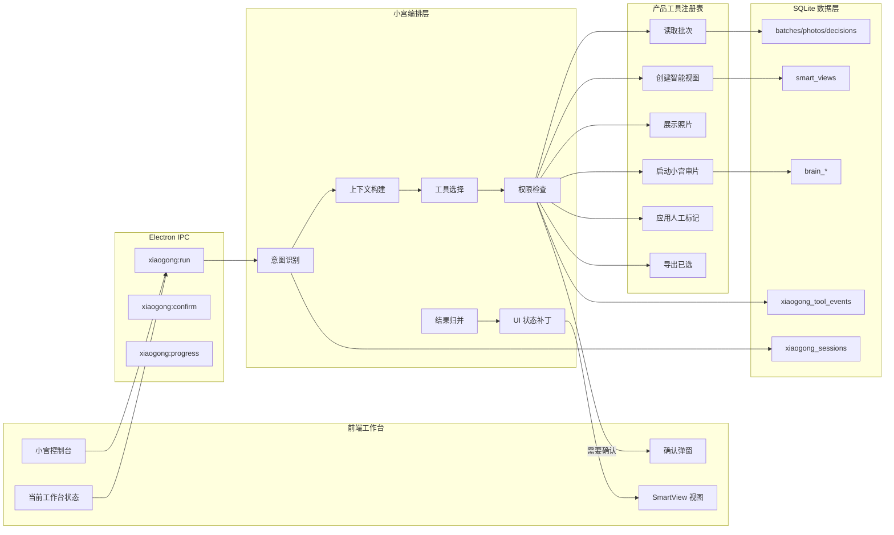
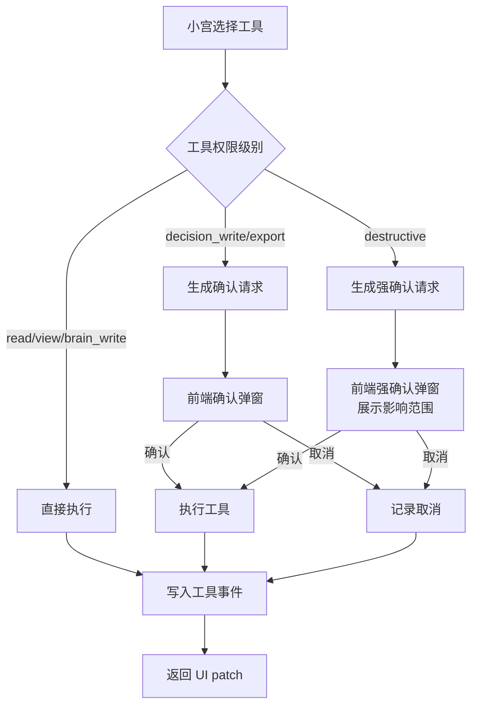
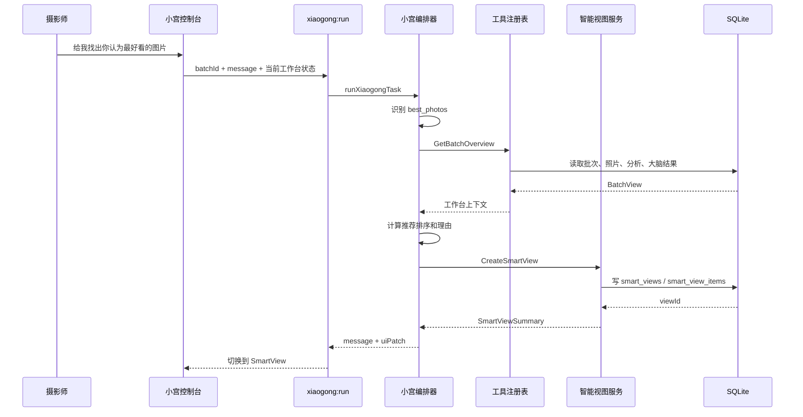

# SenseFrame 小宫产品控制层技术方案

> [!summary]
> 小宫产品控制层的目标不是先做一个聊天框，而是把 SenseFrame 现有功能工具化，让小宫能读取工作台状态、规划任务、调用工具、生成智能视图、切换 UI、解释结果，并在涉及人工决策、导出、删除等动作时走确认。MVP 第一条闭环是“给我找出你认为最好看的图片”。

## 当前代码基础

SenseFrame 现在已经有一批可被工具化的产品能力：

- `photoPipeline.getBatch(batchId)`：读取批次、照片、分析、语义、大脑结果。
- `photoPipeline.listBatches()`：读取批次列表。
- `photoPipeline.saveDecision(photoId, batchId, decision, rating)`：保存人工选择和星级。
- `brainService.startBrainReview(request, onProgress)`：启动批次级小宫审片。
- `brainService.recordBrainFeedback(input)`：记录采纳 / 不采纳大脑建议。
- `openaiService.semanticSearch(batchId, query)`：语义搜索。
- `index.ts export:selected`：导出已选。
- `preload/index.ts`：已经暴露基础 IPC API 给前端。
- `src/main.tsx`：已有左侧分组、主图、胶片条、右侧大脑评价、进度面板。

这些能力现在主要由 UI 按钮直接调用。小宫产品控制层要做的是：在这些能力上方增加一个“工具注册 + 任务编排 + UI 状态补丁”的控制层。

## 技术目标

第一阶段要达成：

1. 用户在右侧小宫入口输入一句自然语言。
2. 后端识别为固定意图，例如 `best_photos`。
3. 小宫读取当前 batch、当前分组、当前照片、大脑结果和本地分析。
4. 小宫调用内部工具生成一个 `SmartView`。
5. 前端切换到这个 SmartView，并展示排序、理由和摘要。
6. 全程不修改人工 decision，不导出，不删除原片。

长期目标：

- 小宫可以操作所有非破坏性工作台状态。
- 小宫可以发起审片、复核、对比、筛选、解释、导出准备。
- 小宫涉及写人工选择、导出、删除时必须走确认。
- 所有小宫工具调用可追踪、可回放、可调试。

## 总体架构



## 核心模块

### 1. `xiaogongOrchestrator.ts`

位置：

```text
electron/main/xiaogongOrchestrator.ts
```

职责：

- 接收前端自然语言任务。
- 构建当前工作台上下文。
- 调用意图识别。
- 从工具注册表选择工具。
- 执行权限检查。
- 聚合工具输出。
- 返回自然语言回复和 UI patch。
- 写入 session 和 tool events。

接口建议：

```ts
export async function runXiaogongTask(
  request: XiaogongRunRequest,
  onProgress?: (event: XiaogongProgressEvent) => void
): Promise<XiaogongRunResult>;
```

### 2. `xiaogongToolRegistry.ts`

位置：

```text
electron/main/xiaogongToolRegistry.ts
```

职责：

- 统一注册可被小宫调用的产品能力。
- 每个工具声明输入、输出、权限级别、是否需要确认。
- 工具处理函数只调用现有 services，不直接绕开业务层写数据库。

工具定义：

```ts
type XiaogongToolDefinition<Input, Output> = {
  name: string;
  description: string;
  permission: XiaogongPermissionLevel;
  requiresConfirmation: boolean;
  inputSchema: unknown;
  handler: (input: Input, context: XiaogongToolContext) => Promise<Output>;
};
```

权限级别：

```ts
type XiaogongPermissionLevel =
  | 'read'
  | 'view'
  | 'brain_write'
  | 'decision_write'
  | 'export'
  | 'destructive';
```

### 3. `xiaogongSmartViewService.ts`

位置：

```text
electron/main/xiaogongSmartViewService.ts
```

职责：

- 创建、读取、删除智能视图。
- 存储照片排序、分数、理由、建议动作。
- 支持临时视图和持久视图。
- 给前端提供 `SmartView` 数据。

MVP 最重要的能力是：

```text
CreateSmartView(best_photos)
ShowSmartView(viewId)
```

### 4. `xiaogongIntent.ts`

位置：

```text
electron/main/xiaogongIntent.ts
```

MVP 不需要一开始就上复杂 agent planning，可以先做固定意图识别。

支持意图：

- `best_photos`：找最好看的。
- `cover_candidates`：找封面候选。
- `closed_eye_misread`：复核闭眼误判。
- `group_representatives`：每组连拍选代表图。
- `explain_current_photo`：解释当前照片。
- `batch_review`：重新审片。

第一版可以规则 + LLM fallback：

```ts
function classifyXiaogongIntent(message: string): XiaogongIntent {
  if (/最好看|最佳|精选|推荐/.test(message)) return { type: 'best_photos' };
  if (/封面|头图|社媒/.test(message)) return { type: 'cover_candidates' };
  if (/闭眼|眼睛|误判/.test(message)) return { type: 'closed_eye_misread' };
  if (/连拍|每组|代表图|重复/.test(message)) return { type: 'group_representatives' };
  if (/解释|为什么|这张/.test(message)) return { type: 'explain_current_photo' };
  return { type: 'unknown' };
}
```

### 5. `xiaogongUiPatch`

小宫返回的不只是文字，还要返回前端可执行的 UI patch。

```ts
type XiaogongUiPatch = {
  mode?: 'bucket' | 'search' | 'smartView';
  smartViewId?: string;
  activePhotoId?: string;
  inspectorPanel?: 'photo' | 'brain' | 'xiaogong';
  notice?: string;
  requireConfirmation?: XiaogongConfirmation;
};
```

前端只执行 UI patch，不直接相信任意工具输出。

## IPC 设计

### Preload API

新增：

```ts
runXiaogong: (payload: XiaogongRunRequest) => Promise<XiaogongRunResult>
confirmXiaogongAction: (payload: XiaogongConfirmRequest) => Promise<XiaogongRunResult>
getSmartView: (viewId: string) => Promise<SmartView>
onXiaogongProgress: (callback: (event: XiaogongProgressEvent) => void) => (() => void)
```

### Main IPC

新增：

```ts
ipcMain.handle('xiaogong:run', async (event, payload) =>
  runXiaogongTask(payload, (progress) => {
    event.sender.send('xiaogong:progress', progress);
  })
);

ipcMain.handle('xiaogong:confirm', async (_event, payload) =>
  confirmXiaogongAction(payload)
);

ipcMain.handle('xiaogong:getSmartView', async (_event, viewId) =>
  getSmartView(viewId)
);
```

## 类型设计

放在：

```text
electron/shared/types.ts
```

核心类型：

```ts
export type XiaogongIntentType =
  | 'best_photos'
  | 'cover_candidates'
  | 'closed_eye_misread'
  | 'group_representatives'
  | 'explain_current_photo'
  | 'batch_review'
  | 'unknown';

export type XiaogongRunRequest = {
  batchId: string;
  message: string;
  currentMode?: string;
  activePhotoId?: string;
  smartViewId?: string;
};

export type XiaogongRunResult = {
  sessionId: string;
  status: 'completed' | 'needs_confirmation' | 'failed';
  intent: XiaogongIntentType;
  message: string;
  summary?: string;
  uiPatch?: XiaogongUiPatch;
  smartView?: SmartViewSummary;
  toolEvents: XiaogongToolEventSummary[];
  confirmation?: XiaogongConfirmation;
};

export type SmartView = {
  id: string;
  batchId: string;
  name: string;
  source: 'xiaogong';
  intent: XiaogongIntentType;
  query: string;
  summary: string;
  items: SmartViewItem[];
  createdAt: string;
};

export type SmartViewItem = {
  photoId: string;
  rank: number;
  score: number;
  reason: string;
  actionHint?: 'pick' | 'maybe' | 'reject' | 'review' | 'none';
  needsHumanReview: boolean;
};
```

## 数据库设计

### `xiaogong_sessions`

记录一次用户和小宫的交互。

```sql
CREATE TABLE IF NOT EXISTS xiaogong_sessions (
  id TEXT PRIMARY KEY,
  batch_id TEXT NOT NULL,
  user_message TEXT NOT NULL,
  intent TEXT NOT NULL,
  status TEXT NOT NULL,
  summary TEXT,
  ui_patch_json TEXT,
  created_view_id TEXT,
  requires_confirmation INTEGER NOT NULL DEFAULT 0,
  created_at TEXT NOT NULL,
  updated_at TEXT NOT NULL
);
```

### `xiaogong_tool_events`

记录小宫调用了哪些工具。

```sql
CREATE TABLE IF NOT EXISTS xiaogong_tool_events (
  id TEXT PRIMARY KEY,
  session_id TEXT NOT NULL,
  tool_name TEXT NOT NULL,
  permission_level TEXT NOT NULL,
  requires_confirmation INTEGER NOT NULL,
  input_json TEXT NOT NULL,
  output_json TEXT,
  status TEXT NOT NULL,
  error TEXT,
  created_at TEXT NOT NULL
);
```

### `smart_views`

记录小宫生成的智能视图。

```sql
CREATE TABLE IF NOT EXISTS smart_views (
  id TEXT PRIMARY KEY,
  batch_id TEXT NOT NULL,
  name TEXT NOT NULL,
  source TEXT NOT NULL,
  intent TEXT NOT NULL,
  query TEXT NOT NULL,
  summary TEXT NOT NULL,
  photo_count INTEGER NOT NULL,
  created_at TEXT NOT NULL,
  updated_at TEXT NOT NULL
);
```

### `smart_view_items`

记录智能视图里的照片、排序和理由。

```sql
CREATE TABLE IF NOT EXISTS smart_view_items (
  view_id TEXT NOT NULL,
  photo_id TEXT NOT NULL,
  rank INTEGER NOT NULL,
  score REAL NOT NULL,
  reason TEXT NOT NULL,
  action_hint TEXT,
  needs_human_review INTEGER NOT NULL,
  metadata_json TEXT NOT NULL DEFAULT '{}',
  PRIMARY KEY(view_id, photo_id)
);
```

## 工具清单

### 第一阶段工具

| 工具 | 权限 | 是否确认 | 说明 |
| --- | --- | --- | --- |
| `GetWorkspaceContext` | `read` | 否 | 读取当前 batch、mode、activePhoto、已有 brainRun |
| `GetBatchOverview` | `read` | 否 | 读取批次照片、分组、分析、人工 decision |
| `CreateSmartView` | `view` | 否 | 创建小宫智能视图 |
| `ShowSmartView` | `view` | 否 | 返回前端 UI patch |
| `RecordToolEvent` | `brain_write` | 否 | 记录工具调用日志 |

### 第二阶段工具

| 工具 | 权限 | 是否确认 | 说明 |
| --- | --- | --- | --- |
| `StartBrainReview` | `brain_write` | 否 | 调用现有小宫审片 |
| `ExplainPhoto` | `read` | 否 | 解释当前照片为什么在这个桶 |
| `ReviewClosedEyeMisread` | `brain_write` | 否 | 复核闭眼误判并生成 SmartView |
| `CreateGroupRepresentativeView` | `brain_write` | 否 | 每组连拍选代表图 |

### 需要确认的工具

| 工具 | 权限 | 是否确认 | 说明 |
| --- | --- | --- | --- |
| `ApplyDecision` | `decision_write` | 是 | 修改单张 pick / maybe / reject |
| `BatchApplyDecisions` | `decision_write` | 是 | 批量修改人工 decision |
| `SetRating` | `decision_write` | 是 | 修改星级 |
| `ExportSelected` | `export` | 是 | 导出已选 |
| `DeleteBatch` | `destructive` | 强确认 | 删除批次 |
| `DeleteOriginalFiles` | `destructive` | 强确认 | 删除原片 |

## 权限与确认流程



确认请求必须包含：

- 将要执行什么动作。
- 影响多少张照片。
- 是否会覆盖人工 decision。
- 是否会导出或删除原片。
- 可回滚性。

## MVP：`给我找出你认为最好看的图片`

### 评分输入

第一版不调用新的视觉模型，先基于已有数据生成 SmartView。

输入信号：

- `photo.brainReview.visualScores.visualQuality`
- `photo.brainReview.visualScores.expression`
- `photo.brainReview.visualScores.moment`
- `photo.brainReview.visualScores.composition`
- `photo.brainReview.visualScores.backgroundCleanliness`
- `photo.brainReview.visualScores.storyValue`
- `photo.brainReview.primaryBucket`
- `photo.brainReview.recommendedAction`
- `photo.brainReview.needsHumanReview`
- `photo.analysis.finalScore`
- `photo.analysis.riskFlags`
- `photo.decision`
- `photo.rating`
- 近重复 / 连拍组 rank

如果没有 completed brain run，就用小模型 fallback，并在回复里说明：

```text
我先基于本地分析和人工选择生成了一版临时精选。跑一次“小宫审片”后结果会更准。
```

### 排序公式

MVP 可以先用可解释规则，不要直接黑盒。

```text
score =
  visualQuality * 0.20
  + expression * 0.18
  + moment * 0.18
  + composition * 0.14
  + backgroundCleanliness * 0.10
  + storyValue * 0.12
  + localQuality * 0.08
  + manualBoost
  - riskPenalty
  - duplicatePenalty
```

规则：

- 人工 `pick` 加权。
- 人工 `reject` 排除，除非用户明确要求复查。
- `needsHumanReview` 不直接排除，但降低排名并说明。
- 每个近重复组优先保留代表图，备选图降低排名。
- `closedEyes`、`technical`、`subject` 不是绝对淘汰，但要有惩罚。

### 执行流程



### 返回结果示例

```json
{
  "sessionId": "xg_123",
  "status": "completed",
  "intent": "best_photos",
  "message": "我找出了 24 张小宫精选。排序优先考虑表情自然、关键瞬间、组内代表性和已有人工选择。",
  "uiPatch": {
    "mode": "smartView",
    "smartViewId": "view_123",
    "activePhotoId": "photo_001",
    "inspectorPanel": "xiaogong"
  },
  "smartView": {
    "id": "view_123",
    "name": "小宫精选 24",
    "photoCount": 24
  }
}
```

## 前端改造

### 状态新增

`src/main.tsx` 新增：

```ts
const [xiaogongBusy, setXiaogongBusy] = useState('');
const [xiaogongMessages, setXiaogongMessages] = useState<XiaogongMessage[]>([]);
const [activeSmartView, setActiveSmartView] = useState<SmartView | null>(null);
const [pendingConfirmation, setPendingConfirmation] = useState<XiaogongConfirmation | null>(null);
```

### 视图模式新增

当前 `ViewMode` 需要增加：

```ts
type ViewMode = ExistingViewMode | 'smartView';
```

`visiblePhotos` 增加：

```ts
if (mode === 'smartView' && activeSmartView) {
  const byId = new Map(batch.photos.map((photo) => [photo.id, photo]));
  return activeSmartView.items
    .map((item) => byId.get(item.photoId))
    .filter((photo): photo is PhotoView => Boolean(photo));
}
```

### 右侧小宫控制台

放在 inspector 的大脑区域附近。

MVP 组成：

- 输入框。
- 发送按钮。
- 建议指令：
  - 找最好看的。
  - 找封面候选。
  - 复核闭眼误判。
  - 每组连拍选 1 张。
- 最近一次结果摘要。
- 当前 SmartView 的照片理由。

## 后端实现拆分

### 第一批文件

```text
electron/main/xiaogongIntent.ts
electron/main/xiaogongSmartViewService.ts
electron/main/xiaogongToolRegistry.ts
electron/main/xiaogongOrchestrator.ts
```

### 修改文件

```text
electron/main/db.ts
electron/main/index.ts
electron/preload/index.ts
electron/shared/types.ts
src/main.tsx
src/styles.css
```

## 阶段路线

### 阶段 1：SmartView 闭环

目标：跑通“找最好看的图片”。

任务：

- 新增 `smart_views` / `smart_view_items`。
- 新增 `xiaogong_sessions` / `xiaogong_tool_events`。
- 新增 `best_photos` 意图。
- 新增 `CreateSmartView`。
- 前端支持 `smartView` mode。
- 右侧增加小宫输入框。

完成标准：

- 输入“给我找出你认为最好看的图片”后，工作台切到“小宫精选”。
- 胶片条按小宫排序。
- 右侧能解释当前照片为什么入选。
- 不改人工 decision。

### 阶段 2：小宫工具注册表

目标：让工具权限和日志稳定下来。

任务：

- 工具定义标准化。
- 所有小宫工具调用写 `xiaogong_tool_events`。
- 加入权限检查。
- 加入确认流程骨架。

### 阶段 3：更多固定意图

目标：覆盖最有价值的摄影工作流。

任务：

- `cover_candidates`
- `closed_eye_misread`
- `group_representatives`
- `explain_current_photo`
- `batch_review`

### 阶段 4：接入记忆系统

目标：小宫能结合摄影师偏好。

任务：

- 调用 `retrieveXiaogongMemories`。
- best_photos 排序加入偏好上下文。
- 用户口头策略写入 batch strategy memory。
- SmartView 生成记录 memory events。

### 阶段 5：多步任务和确认动作

目标：小宫可以准备批量操作，但必须确认。

任务：

- `BatchApplyDecisions`
- `ExportSelected`
- 影响范围预览。
- 确认后执行。
- 取消也记录 tool event。

## 风险与边界

### 不要一开始做通用 Agent

MVP 不需要自由工具调用。先做固定意图和有限工具链，否则调试成本太高。

### 不要让小宫直接写人工选择

SmartView 和 brain result 是小宫自己的状态。人工 decision 必须用户确认。

### 不要复制一套照片状态

SmartView 只存 view item 和理由，不复制 `PhotoView` 全量数据。照片真实状态仍然来自 `getBatch`。

### 不要让前端自己算业务结果

前端只展示 SmartView 和执行 UI patch。排序、理由、工具调用在后端完成。

### 不要把确认做成普通弹窗

确认必须展示影响范围，尤其是批量标记、导出、删除。

## 验收标准

第一阶段完成后应满足：

- 小宫入口能接收自然语言任务。
- 后端能创建 session 和 tool events。
- 小宫能读取当前 batch 并生成 SmartView。
- 前端能切换到 SmartView。
- 每张照片有排序理由。
- 用户可以继续用现有 pick / reject / maybe / rating。
- 不影响现有 AI 分组和小宫审片。
- 没有 fake data。
- 失败时返回明确错误和 session id。

## 设计结论

小宫产品控制层应该先做“可控的产品工具编排”，不是先做开放式聊天 Agent。

第一步用 `best_photos -> SmartView -> UI patch` 打通自然语言到产品状态变化的闭环。之后再把审片、复核、组内比较、解释、确认动作逐步接进工具注册表。这样既能体现“小宫是产品灵魂”，又不会破坏 SenseFrame 现有的专业审片工作台。
