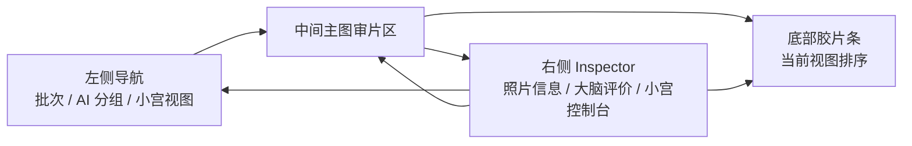
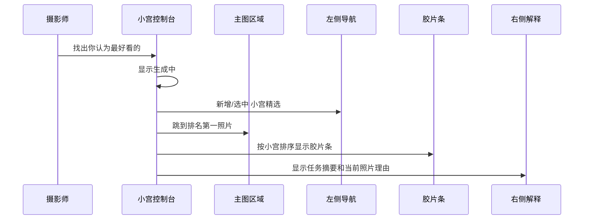
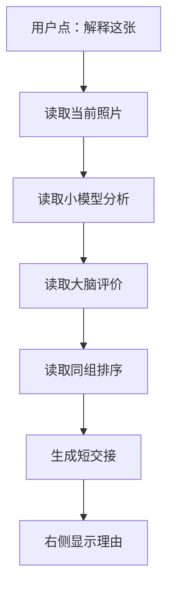
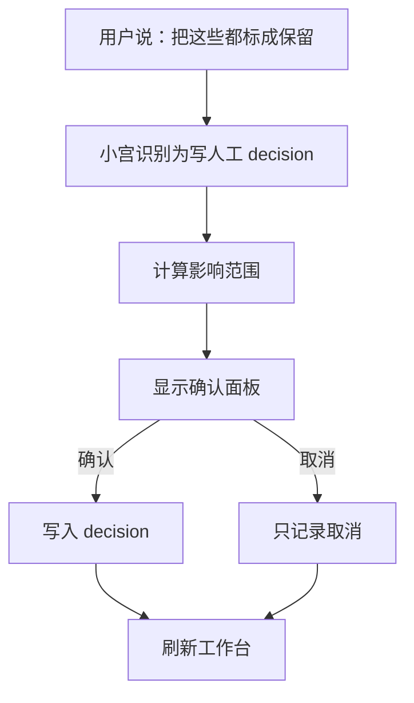

# SenseFrame 小宫产品控制层 UI 形态设计

> [!summary]
> 小宫的 UI 形态不是独立聊天页，也不是覆盖主图的 AI 面板。它应该是 SenseFrame 暗房工作台里的“右侧交接控制台”：用户用自然语言交代任务，小宫操作左侧分组、中间主图、底部胶片条和右侧解释区。视觉上保持摄影工作台的克制、专业、低干扰。

## 形态定位

小宫控制层在 UI 上应该像一个专业摄影助理坐在工作台右侧，而不是像一个通用聊天软件浮在产品上。

核心形态：

```text
左侧：批次 / AI 分组 / 小宫智能视图
中间：主图审片区
底部：胶片条
右侧：照片信息 + 大脑评价 + 小宫控制台
```

小宫说完话后，工作台状态要发生变化：

- 左侧切换或新增“小宫精选”等智能视图。
- 中间主图跳到推荐列表第一张。
- 底部胶片条按小宫排序。
- 右侧显示本次任务摘要和当前照片理由。

## 总体布局



## 页面区域设计

### 1. 左侧导航：增加“小宫视图”

现有左侧保留：

- 批次列表。
- AI 分组。
- 导入、重跑分析、重建近重复。

新增一个区域：`小宫视图`。

位置建议：

```text
批次
AI 分组
小宫视图
```

`小宫视图`里展示小宫生成的 SmartView：

- 小宫精选。
- 封面候选。
- 闭眼误判复核。
- 每组代表图。
- 人工冲突。
- 最近任务结果。

每个 item 包含：

- 视图名称。
- 照片数量。
- 小图标。
- 是否临时。
- 是否有需要复核的照片。

示例：

```text
小宫视图
  小宫精选        24
  封面候选        8
  闭眼误判复核    5
  每组代表图      31
```

视觉规则：

- 不用大面积高亮。
- 当前 SmartView 使用细 cyan 边线或 2px 左侧状态条。
- 临时视图用小号 `临时` 标记。
- 不把小宫视图做成聊天历史。

### 2. 中间主图：仍然以照片为中心

主图区域不应该堆小宫解释。

小宫状态只允许出现极简 HUD：

- 当前视图名称：`小宫精选`
- 当前排名：`03 / 24`
- 当前建议：`建议保留` / `建议复核`
- 冲突标记：`与人工选择冲突`

示例 HUD：

```text
小宫精选 · 03 / 24 · 建议保留
```

不要在图上显示长理由。长理由放右侧。

### 3. 底部胶片条：承载小宫排序

胶片条展示当前 SmartView 的排序。

新增标记：

- 排名：`#1`、`#2`。
- 小宫推荐：细 cyan 标记。
- 需要人工复核：小点或小三角。
- 组内代表图：`G1` / `B2` 保留现有风格。

胶片条不应该因为理由文字变宽变高。只展示稳定小徽标。

### 4. 右侧 Inspector：小宫交接区

右侧是小宫产品形态的核心。

建议把右侧分成三块：

```text
照片技术信息
大脑评价
小宫控制台
```

如果空间紧张，可以用折叠段落或 tabs：

- `照片`
- `大脑`
- `小宫`

MVP 推荐不用复杂 tabs，先在右侧靠下增加一个紧凑“小宫控制台”。

## 小宫控制台结构

### 默认状态

没有运行任务时：

```text
小宫
输入框：对小宫说点什么...
快捷任务：
  找最好看的
  找封面候选
  复核闭眼误判
  每组连拍选 1 张
```

文案原则：

- 不说“我能帮你做什么”。
- 不写说明书。
- 不展示长帮助文案。
- 直接给任务入口。

### 输入框

位置：

- 小宫控制台底部或顶部都可以。
- MVP 建议放控制台底部，和聊天习惯一致，但不做完整聊天流。

形态：

- 单行输入，回车发送。
- 支持 `Shift + Enter` 换行，但不强调。
- 右侧发送按钮使用图标。
- placeholder：`对小宫说：找出最好看的`

### 快捷任务 chips

用短文字按钮，不要做大卡片。

推荐：

- 找最好看的
- 找封面候选
- 复核闭眼
- 每组选 1 张

点击后直接填入并执行，或直接执行固定意图。

### 任务结果摘要

小宫执行完成后，控制台显示一段交接：

```text
小宫精选 · 24 张
优先按表情自然、关键瞬间、组内代表性和已有人工选择排序。
其中 5 张需要你复核。
```

摘要下面显示操作：

- 查看视图。
- 重新生成。
- 应用建议。

`应用建议` 属于确认动作，不能直接执行。

### 当前照片理由

当 SmartView 激活时，右侧显示当前照片为什么进入这个视图。

示例：

```text
#03 小宫精选
表情自然，动作完整，是连拍组 B4 的代表图。背景略乱，但故事感比同组其它照片更强。

建议：保留
复核：否
```

如果需要人工复核：

```text
#07 待复核
小模型标记疑似闭眼，但更像笑眼。建议你和同组 B2-03 二次比较。

建议：待定
复核：是
```

## 状态设计

### 空状态

没有批次：

```text
导入照片后，小宫可以帮你整理候选、复核风险和比较连拍。
```

有批次但没有大脑结果：

```text
可以先让小宫基于本地分析找候选；跑一次“小宫审片”后会更准。
```

### 运行中

小宫运行时不应该只显示 spinner。

展示阶段：

- 正在读取批次。
- 正在整理照片信号。
- 正在生成推荐排序。
- 正在写入小宫视图。
- 正在切换工作台。

示例：

```text
正在生成小宫精选
读取 186 张照片 · 已比较 14 个相似组
```

### 完成

完成后右侧显示：

- 视图名称。
- 照片数量。
- 策略摘要。
- 需要人工复核数量。
- 当前照片理由。

### 需要确认

当用户要求批量应用时，进入确认状态。

示例：

```text
将 24 张照片标记为保留
其中 3 张原本是待定，0 张是人工淘汰。
确认后会写入人工 decision。
```

按钮：

- 确认标记。
- 取消。

破坏性操作必须更强：

- 显示原片数量。
- 显示不可逆提示。
- 要求二次确认。

### 失败

失败时保留任务记录。

示例：

```text
小宫没有完成这次任务
原因：当前批次没有可用照片。
```

如果部分完成：

```text
已生成 18 张候选，但 6 张缺少预览，已放入复核。
```

## 关键流程

### 流程 1：找最好看的



### 流程 2：解释当前照片



### 流程 3：批量应用建议



## SmartView 产品形态

SmartView 是小宫控制层最重要的 UI 产物。

它不是新的照片实体，也不是新的 AI 分组永久替代品，而是一组“按任务生成的照片视图”。

SmartView 包含：

- 视图名称。
- 任务来源。
- 照片列表。
- 排名。
- 每张照片理由。
- 建议动作。
- 是否需要人工复核。

SmartView 的 UI 表现：

- 左侧有入口。
- 中间主图和底部胶片条按 SmartView 排序。
- 右侧解释当前照片。
- 可以关闭或重新生成。

MVP SmartView：

```text
小宫精选 24
```

后续：

```text
封面候选 8
闭眼误判复核 5
每组代表图 31
人工冲突 3
```

## 与现有 UI 的关系

### 不替代 AI 分组

AI 分组仍然存在：

- 精选候选
- 疑似闭眼
- 眼部复核
- 主体问题
- 技术问题
- 近重复
- 相似连拍
- 待判断

小宫 SmartView 是临时任务视图，可以跨分组选照片。

### 不替代大脑评价

大脑评价仍然是单张照片交接卡。

小宫控制台是任务控制和结果视图。

关系：

```text
大脑评价：这张为什么这样判断
小宫控制台：这次任务做了什么、结果是什么、下一步怎么操作
```

### 不替代人工操作

现有快捷键继续有效：

- `P` 保留。
- `X` 淘汰。
- `U` 待定。
- `1-5` 星级。
- 左右切图。
- 上下切组。

小宫只是改变当前照片列表和解释，不阻断人工审片速度。

## 视觉设计规则

### 颜色

沿用 `DESIGN.md`：

- Cyan：小宫运行、智能视图、AI 焦点。
- Gold：人工选择、主推荐、精选。
- Red：拒绝、删除、破坏性确认。

小宫控制台不要大面积 cyan。用：

- 1px active border。
- 2px 状态条。
- 小徽标。
- 细进度线。

### 形态

不要做：

- 浮动大聊天窗。
- 全屏 Agent 页面。
- 大块欢迎说明。
- 营销式 hero。
- 卡片套卡片。

应该做：

- 紧凑右侧面板。
- 工具型输入框。
- 短任务按钮。
- 细线状态反馈。
- 当前照片交接卡。

### 文案

短、直接、工作流导向。

推荐：

- `小宫`
- `找最好看的`
- `复核闭眼`
- `每组选 1 张`
- `小宫精选`
- `需要复核`
- `应用建议`

避免：

- `我是你的智能摄影助理`
- `我可以帮你完成很多事情`
- `探索 AI 的无限可能`

## MVP 界面草图

```text
┌──────────────────────────────────────────────────────────────────────────┐
│ 顶部：精选候选 · 24                         [小宫审片] [调试框] [导出] │
├──────────────┬───────────────────────────────────────┬───────────────────┤
│ 批次          │                                       │ 照片信息           │
│ AI 分组       │              主图审片区                │ 大脑评价           │
│ 小宫视图      │                                       │                   │
│  小宫精选 24  │                                       │ 小宫              │
│  封面候选 8   │                                       │ ┌───────────────┐ │
│              │                                       │ │ 找出最好看的...│ │
│              │                                       │ └───────────────┘ │
│              │                                       │ [找最好看的]      │
│              │                                       │ [复核闭眼]        │
│              │                                       │                   │
│              │                                       │ 小宫精选 · 24 张  │
│              │                                       │ #03 入选理由...   │
├──────────────┴───────────────────────────────────────┴───────────────────┤
│ 胶片条：#1  #2  #3  #4  #5 ...                                            │
└──────────────────────────────────────────────────────────────────────────┘
```

## 第一版验收标准

UI 第一版完成后应该满足：

- 右侧出现“小宫控制台”。
- 用户能输入“找最好看的”。
- 小宫生成 SmartView 后，左侧出现“小宫精选”。
- 主图跳到排名第一。
- 胶片条按小宫排序。
- 右侧显示任务摘要和当前照片理由。
- 用户可以继续用 `P/X/U/1-5` 正常审片。
- 没有独立聊天页。
- 没有覆盖主图的大解释层。
- 不做破坏性操作。

## 设计结论

小宫的 UI 产品形态应该是“工作台控制台”，不是聊天产品。

它的价值不在于说话，而在于说完之后能改变 SenseFrame 的工作台状态：生成照片视图、切换主图、重排胶片条、解释当前照片、准备下一步操作。第一版先把“小宫精选 SmartView”做顺，后续再逐步扩展到封面候选、闭眼误判复核、每组代表图和确认式批量操作。
